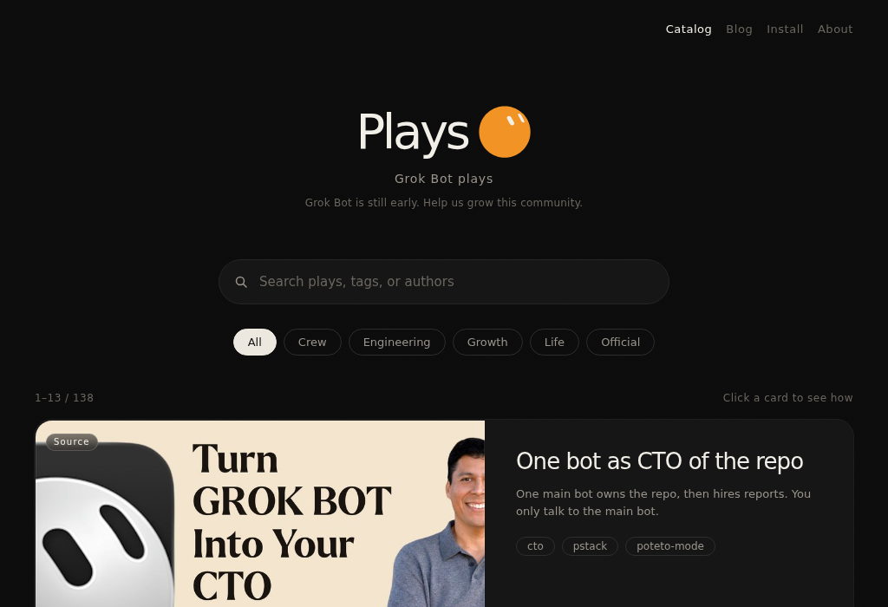

# Plays

Grok Bot plays. An unofficial how-to catalog, not affiliated with xAI / Grok.
Every entry is rewritten from a public post or official doc, and every entry has a source link.

[grokbotplays.com](https://grokbotplays.com/)

138 English plays on the site. 33 Chinese write-ups still live at `/zh/` (the language switch is hidden).

## Catalog

### Official

- [Research overnight, park the drafts](https://grokbotplays.com/play/official-sales-outbound) — xAI
- [Walk the demo overnight, land the ready list](https://grokbotplays.com/play/official-demo-readiness) — xAI
- [Land a Monday scoreboard, park the writes](https://grokbotplays.com/play/official-pipeline-ops) — xAI
- [Keep accounts warm, park the send](https://grokbotplays.com/play/official-account-followup) — xAI
- [Scout the role, park the outreach](https://grokbotplays.com/play/official-talent-scout) — xAI Docs
- [Reconcile the week, park the chase](https://grokbotplays.com/play/official-expense-manager) — xAI Docs
- [Teach it first. Then let it run overnight.](https://grokbotplays.com/play/official-teach-routine) — xAI Docs
- [Split three lanes, take only the calls](https://grokbotplays.com/play/official-internal-handoffs) — xAI
- [Brute-force the path, bring back the failures](https://grokbotplays.com/play/official-playtest) — xAI
- [Launch cloud agents, come back with a branch](https://grokbotplays.com/play/official-cloud-agent-orchestration) — xAI
- [Chase unpaid invoices, escalate the stuck ones](https://grokbotplays.com/play/official-invoice-follow-up) — xAI
- [Morning yes-or-no on outbound replies](https://grokbotplays.com/play/official-outbound-triage) — xAI
- [Watch PRs, only pull humans for real calls](https://grokbotplays.com/play/official-pr-ci-triage) — xAI
- [A request in, a clickable URL back](https://grokbotplays.com/play/official-prototype-builder) — xAI
- [Fill the questionnaire, stop at review](https://grokbotplays.com/play/official-security-questionnaires) — xAI
- [Lock the voice, draft when it ships](https://grokbotplays.com/play/official-social-posting) — xAI
- [Click the same vendor path every week](https://grokbotplays.com/play/official-vendor-portals) — xAI
- [A credit-committee pack that writes itself back into Box](https://grokbotplays.com/play/box-credit-committee) — Box
- [Invite guests, chase vendors, push the list](https://grokbotplays.com/play/official-event-logistics) — xAI
- [Shared inbox: mark urgent, park the reply](https://grokbotplays.com/play/official-inbox-triage) — xAI
- [Write it in Notion, open it in Linear](https://grokbotplays.com/play/official-spec-ticket-handoff) — xAI
- [Who asked for what, tied to a customer](https://grokbotplays.com/play/official-feature-requests) — xAI
- [Invites, NDAs, then access with a trail](https://grokbotplays.com/play/official-beta-access) — xAI

### Crew

- [One bot as CTO of the repo](https://grokbotplays.com/play/ray-cto-pstack) — Ray Fernando
- [Map yesterday to your priorities. Change nothing.](https://grokbotplays.com/play/official-chief-of-staff) — xAI Docs
- [One chief first. Then the fleet](https://grokbotplays.com/play/debbie-chief-team) — Debbie O'Brien
- [One listing this week. Not a bookmark pile](https://grokbotplays.com/play/elie-bot-directory) — Elie Steinbock
- [One pass, three buckets for applicants](https://grokbotplays.com/play/eric-recruiting-reviewer) — eric zakariasson
- [One desk. Not twelve on day one](https://grokbotplays.com/play/dennis-ops-desk) — Dennis Yu
- [Stand the overnight post. Then close the laptop](https://grokbotplays.com/play/promptway-overnight-job) — Promptway
- [Brain-dump first, then let one bot hire the rest](https://grokbotplays.com/play/alexfinn-brain-dump-fleet) — Alex Finn
- [Hire a crew, then prune it weekly](https://grokbotplays.com/play/codez-10-step-life-crew) — Codez
- [Morning planner, then a Slack trigger that actually fires](https://grokbotplays.com/play/mindstudio-morning-slack-trigger) — MindStudio
- [Twelve bots on one computer, each owns a theme](https://grokbotplays.com/play/nate-theme-not-task) — Nate
- [Researcher, writer, then a chief who runs them](https://grokbotplays.com/play/shumer-researcher-writer-cos) — Matt Shumer
- [A product roster: CoS, EM, five ICs, data, PM Pete](https://grokbotplays.com/play/n2parko-core-team) — n2parko
- [A chief of staff, then one debrief at the end of the day](https://grokbotplays.com/play/rundown-cos-team) — The Rundown
- [Six seats for a one-person company](https://grokbotplays.com/play/sairahul-one-person-company) — Rahul
- [Hire the night shift, one job each](https://grokbotplays.com/play/prajwal-five-businesses-night-shift) — Prajwal Tomar
- [Demo Bot, Content Bot, then the Friday cart](https://grokbotplays.com/play/mattyp-intro-demo-content-grocery) — matt palmer
- [Klaus is the only bot you talk to](https://grokbotplays.com/play/nateherk-nine-hacks-klaus) — Nate Herk
- [Start with one Chief of Staff](https://grokbotplays.com/play/liam-fallen-one-cos-first) — Liam Fallen
- [Pulse writes the scorecard. Honey runs hiring ops.](https://grokbotplays.com/play/michelle-freitas-pulse-honey) — Michelle Freitas
- [One morning briefing, then notes into scorecards](https://grokbotplays.com/play/hanna-niapas-recruiting-loop) — Hanna Niapas
- [A 9am Slack brief, then Granola into Ashby](https://grokbotplays.com/play/adam-rousseau-slack-brief) — Adam Rousseau
- [Cartman queries Databricks, then delegates](https://grokbotplays.com/play/simon-lackowski-south-park-roster) — Simon Lackowski
- [File Ramp from Gmail. Ping me only on a decision](https://grokbotplays.com/play/sidhant-uthra-ramp-travel-prs) — Sidhant Uthra
- [Farm the transcript into Linear. Orbit runs the desk](https://grokbotplays.com/play/scott-metcalf-task-farming-orbit) — Scott Metcalf
- [Chief, Mailman, Poster, Scribe, and Coach](https://grokbotplays.com/play/joebenson-five-bots-coach) — Joe Benson
- [One CoS, six specialists, brief to invoice](https://grokbotplays.com/play/mikenevermiss-seven-agent-ops) — Mike
- [Give Atlas an org chart, not a to-do list](https://grokbotplays.com/play/demkinn-org-chart-roster) — Demkinn
- [Smith briefs. Architect ships. Weekend planner books the vineyard](https://grokbotplays.com/play/ashley-osborne-matrix-roster) — Ashley Osborne
- [Four chiefs: Slack, email, product, then the morning brief](https://grokbotplays.com/play/richard-zhang-slack-email-product) — Richard Zhang
- [Capture the desk. Juno talks the data problem through](https://grokbotplays.com/play/matthew-silberman-juno-revops) — Matthew Silberman
- [CoS that briefs you, rebuilds slides, writes the sales rule](https://grokbotplays.com/play/david-carbutt-cos-slides-stripe) — David Carbutt
- [Draw the seats. Hire Head of Talent first](https://grokbotplays.com/play/ed-dale-yellow-pad-newsletter) — Ed Dale
- [Park the per-app bots. One mission, two specialists](https://grokbotplays.com/play/aijoey-one-mission-article) — Joey
- [Teach the cart on one restaurant. Run it on the other](https://grokbotplays.com/play/anthony-battaglia-pfg-teach) — Anthony Battaglia

### Engineering

- [Find the hotspot, leave production alone](https://grokbotplays.com/play/official-product-performance) — xAI Docs
- [Reproduce in staging, bring back the pack](https://grokbotplays.com/play/official-bug-reproduction) — xAI Docs
- [Find the issue. Then close it](https://grokbotplays.com/play/debbie-coding-github) — Debbie O'Brien
- [One request across the repos](https://grokbotplays.com/play/jesse-multi-repo) — Jesse Hanley
- [One research bot, three competitors, four minutes](https://grokbotplays.com/play/joe-competitor-research) — Joe Njenga
- [Say the repo name. Merge it back to the desk.](https://grokbotplays.com/play/azumimusuhi-local-merge) — 伊藤貴將
- [Firstmate runs a scout-vs-ship factory](https://grokbotplays.com/play/kunchenguid-grok-ship) — kunchenguid
- [Scan the placeholders, then put card art on autopilot](https://grokbotplays.com/play/dannylimanseta-game-art-autopilot) — Danny Limanseta
- [Teach Research Reggie the repo once](https://grokbotplays.com/play/stan-beckers-research-reggie) — Stan Beckers
- [Obsidian vault on the CoS computer, then a daily loop](https://grokbotplays.com/play/av1dlive-obsidian-wiki) — Avid
- [8pm commits become Linear, then a Discord wrap](https://grokbotplays.com/play/jholtdigital-linear-wrap) — Jason Holt
- [Talk to the CEO. QA hits staging. Dev opens draft PRs](https://grokbotplays.com/play/montekkundan-ceo-qa-prs) — Montek
- [Watch the official pages. Stay quiet if nothing moved](https://grokbotplays.com/play/dfc369-code-watcher) — DFC369
- [PM, lead, review. Work until 7am](https://grokbotplays.com/play/harry-munro-overnight-prs) — Harry Munro

### Growth

- [Watch the spend, leave the budget](https://grokbotplays.com/play/official-paid-media) — xAI Docs
- [Rank the watch list, contact nobody](https://grokbotplays.com/play/official-account-health) — xAI Docs
- [Lock the voice. Then dump the note](https://grokbotplays.com/play/debbie-linkedin) — Debbie O'Brien
- [One home post. Then the flywheel](https://grokbotplays.com/play/debbie-content-flywheel) — Debbie O'Brien
- [A hundred uses he saw. Pick one](https://grokbotplays.com/play/eric-100-use-cases) — eric zakariasson
- [Outbound in the voice of your sent mail](https://grokbotplays.com/play/eric-outbound-voice) — eric zakariasson
- [A community ops fleet on a weekly beat](https://grokbotplays.com/play/eric-community-ops) — eric zakariasson
- [Call questions into a living FAQ](https://grokbotplays.com/play/eric-living-faq) — eric zakariasson
- [Forty mills, one lock, a pattern in .ai](https://grokbotplays.com/play/jjcm-vietnam-fabric) — jjcm
- [YouTube manager pings social when a transcript lands](https://grokbotplays.com/play/mindstudio-youtube-social) — MindStudio
- [Alfred, Gordon, Florence: PA, content, brand deals](https://grokbotplays.com/play/remy-alfred-gordon-florence) — Remy
- [Hand the bot a GTM repo, then approve the sends](https://grokbotplays.com/play/bcharleson-gtm-outbound) — bcharleson
- [Watch the support inbox. Draft. Wait.](https://grokbotplays.com/play/chris-support-inbox) — Chris Eyropper
- [Webby, Shotry, Writey, and a Master](https://grokbotplays.com/play/farzad-named-roster) — Farzad
- [A daily read on markets that settle tomorrow](https://grokbotplays.com/play/sid-polymarket-daily) — Sid Shekhar
- [A 7-bot Hyperliquid desk](https://grokbotplays.com/play/galleon-hypergrok-desk) — Galleon Labs
- [Intake the work order, then book the plumber](https://grokbotplays.com/play/househackerjon-plumbing-office) — Jon ONeill
- [Staff a GTM desk you can teach once](https://grokbotplays.com/play/kristaletz-enterprise-gtm) — Krista Letz
- [Hook support mail to Stripe refunds](https://grokbotplays.com/play/gergely-stripe-support-refunds) — Gergely Orosz
- [Content and Leads draft. You keep the veto](https://grokbotplays.com/play/derek-schatz-content-leads-cos) — Derek Schatz
- [Summarize the library. Review the CSV in chat](https://grokbotplays.com/play/will-meinhardt-mach1-research-icp) — Will Meinhardt
- [Give it one job: media buyer](https://grokbotplays.com/play/nwtseira-media-buyer) — Arie
- [Scout, drafter, lead magnet, Notion bank](https://grokbotplays.com/play/anushkaa1407-content-four) — Anushka Gupta
- [Scan X for AI and robotics, drop it in Notion](https://grokbotplays.com/play/deryatr-x-notion-radar) — Derya Unutmaz
- [Monday hire scan, then an Apollo note](https://grokbotplays.com/play/dork-matter-monday-hire-outbound) — Alex
- [Walk, talk, then Typefully drafts in two languages](https://grokbotplays.com/play/jorgediazapps-voice-typefully) — jorgediazapps
- [Two analytics bots, then one outreach bot per network](https://grokbotplays.com/play/kr0der-analytics-outreach) — Anthony Kroeger
- [Trendspotter, WTD, and one bot per live partnership](https://grokbotplays.com/play/jenna-nanpei-sports-vip) — Jenna Nanpei
- [Screen-share how you work a lead. Then it runs the morning](https://grokbotplays.com/play/karanc12-lead-teach-skill) — KC
- [Chronically Online pings Scripter. Three scripts wait](https://grokbotplays.com/play/orcdev-scripter-online) — OrcDev
- [One router, six store bots, one 6am note](https://grokbotplays.com/play/savipww-shopify-six) — savip
- [Permit, inspection, proposal. The roof still needs you](https://grokbotplays.com/play/pricefoulger-roofing-ops) — Price Foulger
- [Five store seats. You still push live](https://grokbotplays.com/play/jaymallen-shopify-five) — Jay Allen
- [Exceptions before 5am. You still walk the 1:1](https://grokbotplays.com/play/priya-bhatia-deep-thought) — Priya Bhatia
- [Mocha is the only chat. Stevie sits on replies](https://grokbotplays.com/play/ryan-tydingco-mocha-stevie) — Ryan Tydingco
- [Name King. One job: find work](https://grokbotplays.com/play/vincent-tellier-king-leads) — Vincent Tellier

### Life

- [One morning podcast. Not two apps first](https://grokbotplays.com/play/debbie-morning-podcast) — Debbie O'Brien
- [One 7am brief. Not five reminders](https://grokbotplays.com/play/elie-daily-briefing) — Elie Steinbock
- [One short list. Not seventy unread](https://grokbotplays.com/play/elie-email-triage) — Elie Steinbock
- [Photo the fault. Stop before you spend](https://grokbotplays.com/play/elie-home-services) — Elie Steinbock
- [A fridge photo, a week of dinners](https://grokbotplays.com/play/eric-fridge-dinner) — eric zakariasson
- [A week of meals, two store carts](https://grokbotplays.com/play/rhys-grocery-autopilot) — Rhys Sullivan
- [Three tiny jobs: seed rounds, a flight, five stores](https://grokbotplays.com/play/aditi-three-test-bots) — Aditi Gupta
- [Trello planner and a LinkedIn draft, from your phone](https://grokbotplays.com/play/maa1-trello-linkedin) — MAA1
- [A home bot that shops, and a cart that waits](https://grokbotplays.com/play/debbie-home-beer-shop) — Debbie O'Brien
- [Twelve jobs on one roster, from images to canceling subs](https://grokbotplays.com/play/gota-twelve-jobs) — Gota
- [Five seats: advisor, YouTube, X, cleanup, travel](https://grokbotplays.com/play/peter-yang-five-bots) — Peter Yang
- [Scan the calendar, then book the table from the lot](https://grokbotplays.com/play/yunta-calendar-reservations) — Yun-Ta Tsai
- [Five player bots, one AI Gamemaster](https://grokbotplays.com/play/heyvhuang-werewolf) — Heyvhuang
- [Teach one search, then a Slack pun loop](https://grokbotplays.com/play/masa-wunder-teach-slack) — まさお
- [Watch the webinar, then brief the ride in one line](https://grokbotplays.com/play/chsrbrts-ridewithgps) — Chase Roberts
- [Photo the pile, print the UPS QR](https://grokbotplays.com/play/eleven21-amazon-returns-pdf) — John Schoenith
- [Hunt unrefunded returns in mail](https://grokbotplays.com/play/darian314-lost-refund-hunt) — Darian Shirazi
- [A named household crew for flights and boxes](https://grokbotplays.com/play/ashwinmatta-household-crew) — Ashwin Matta
- [A finance bot that reads SimpleFin](https://grokbotplays.com/play/spcxtsla-finance-simplefin) — Peter
- [A refund inbox and a sheet of open cases](https://grokbotplays.com/play/axel-refund-case-desk) — Axel Bitblaze
- [7am Tesla routine from the calendar](https://grokbotplays.com/play/heresmyeth-tesla-calendar-manager) — heresmy
- [School mail, gift cards, Zocdoc, Marketplace](https://grokbotplays.com/play/startupstella-mom-ops) — Stella Garber
- [Three bots run a reverse-auction car lease](https://grokbotplays.com/play/chuck-russell-car-shopping) — Chuck Russell
- [Inbox finds the subs. Grinder sits on the cancel button](https://grokbotplays.com/play/tetsuoai-grinder-subs) — tetsuo
- [Feed Petra the manuals. Ask haul-out, not buy](https://grokbotplays.com/play/kazcow-petra-yacht) — KazCow
- [Name the dish. Name the headcount](https://grokbotplays.com/play/teslaconomics-chef) — Teslaconomics
- [Give it the syllabus. It posts next week's homework](https://grokbotplays.com/play/sethjlevy-algebra-classroom) — Seth
- [Personal CFO. Morning brief. You still make the call](https://grokbotplays.com/play/cryptorover-personal-cfo) — cryptorover
- [Point it at Drive. Sort. Don't rename](https://grokbotplays.com/play/laceypresley-riverside-drive) — Lacey Presley
- [Record one clean submit. Freeze if the tab dies](https://grokbotplays.com/play/hassan-chagani-claims-agent) — Hassan Chagani

## Run it

Astro, static output. No SSR. Install deps, then start the dev server.

Production is Cloudflare Pages. Build writes dist/. Play markdown lives in src/content/plays. Covers in public/assets/covers/.

